# 🔐 Escalada de Privilegios — Laboratorio Python (Ubuntu)

Informe técnico de un ejercicio de escalada de privilegios en una máquina Ubuntu, resuelto encadenando diez niveles de usuario (`user1` → `user10`) hasta obtener acceso `root`. Cada nivel oculta la credencial del siguiente dentro de un script en Python (codificada, derivada de una condición lógica, o ambas), siguiendo las reglas de solo lectura impuestas por el propio reto.

| | |
|---|---|
| **Máquina** | Ubuntu (`10.0.2.15`) |
| **Autor** | Jose López Buzón |
| **Fecha de la prueba** | 6/10/2025 – 7/10/2025 |
| **Duración** | 00:10 – 10:05 |
| **Objetivo** | Escalar privilegios hasta obtener acceso `root` |
| **Resultado** | ✅ Acceso `root` confirmado |

## Tabla de contenidos

1. [Reglas del ejercicio](#reglas-del-ejercicio)
2. [Resumen de la cadena de escalada](#resumen-de-la-cadena-de-escalada)
3. [Walkthrough detallado](#walkthrough-detallado)
4. [Estructura del repositorio](#estructura-del-repositorio)
5. [Notas sobre los scripts](#notas-sobre-los-scripts)
6. [Lecciones aprendidas](#lecciones-aprendidas)
7. [Aviso](#aviso)

## Reglas del ejercicio

El reto se planteó con tres restricciones explícitas, respetadas durante toda la prueba:

- No modificar el contenido de los scripts.
- No escribir ficheros nuevos en el directorio de los scripts.
- Solo se permite leer su código e interactuar con ellos (ejecutarlos).

## Resumen de la cadena de escalada

Cada usuario guarda en su carpeta `Documentos/` un script `nivelX.py` (propiedad de `root`, pero ejecutable y legible por el usuario del nivel) que, al ejecutarlo o leerlo, revela la credencial del siguiente usuario en la cadena.

| Nivel | Script | Ubicación | Técnica empleada | Credencial obtenida |
|---|---|---|---|---|
| 1 | `nivel1.py` | `user1/Documentos` | Ejecución directa del script | Pass de **user2**: `S0Easy&Gu1d3d` |
| 2 | `nivel2.py` | `user2/Documentos` | Credencial en comentario dentro del código fuente | Pass de **user3**: `N0C0mm3nts!` |
| 3 | `nivel3.py` | `user3/Documentos` | Autenticación con usuario/contraseña embebidos en claro + Base64 | Pass de **user4**: `H4rdC0de` |
| 4 | `nivel4.py` | `user4/Documentos` | Validación de argumentos por línea de comandos (`sys.argv`) | Pass de **user5**: `P@ramet3rs` |
| 5 | `nivel5.py` | `user5/Documentos` | Clave de validación obtenida de un recurso externo (Gist público) | Pass de **user6**: `Ext3rnalK3Y` |
| 6 | `nivel6.py` | `user6/Documentos` | Constante Base64 embebida en el código | Pass de **user7**: `OneM1llion` |
| 7 | `nivel7_srv.py` | `user7/Documentos` | Servicio socket TCP local + Base64 | Pass de **user8**: `TCP!S0ck3t` |
| 8 | `nivel8.py` | `user8/Documentos` | Mini-juego cuya solución depende de la hora del sistema | Pass de **user9**: `N0tS0Rand0m!` |
| 9 | `nivel9.py` | `user9/Documentos` | Panel con niveles de privilegio; credencial en hexadecimal invertido | Pass de **user10**: `ModifyPrivs&Win` |
| 10 | — | `user10` | `su user10` + `sudo su` | **Acceso root confirmado** (`whoami` → `root`) |

## Walkthrough detallado

### 1. Reconocimiento inicial en `user1`

Acceso a la máquina con las credenciales iniciales proporcionadas. Tras explorar el árbol de directorios accesibles, en `user1/Documentos/` aparecen dos ficheros propiedad de `root`: `README.txt` y `nivel1.py`.

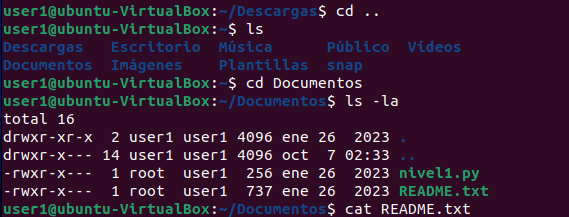

### 2. Obtención de la credencial de `user2`

Al ejecutar `python3 nivel1.py` el script imprime directamente la contraseña de `user2`: `S0Easy&Gu1d3d`. Con ella, `su user2` permite el cambio de usuario.

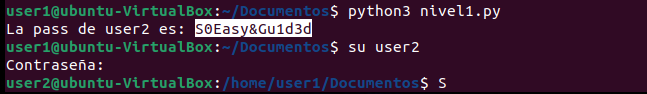

### 3. Acceso a `user2`

Se confirma la ruta `/home/user1` → `/home` → `su user2`, completando el salto de usuario.

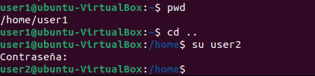

### 4. Lectura de `nivel2.py`

En `user2/Documentos/` se encuentra `nivel2.py`. A diferencia del nivel anterior, aquí no es necesario ejecutar el script: la credencial de `user3` está escrita directamente en un comentario del código fuente (`# La pass de user3 es N0C0mm3nts!`).

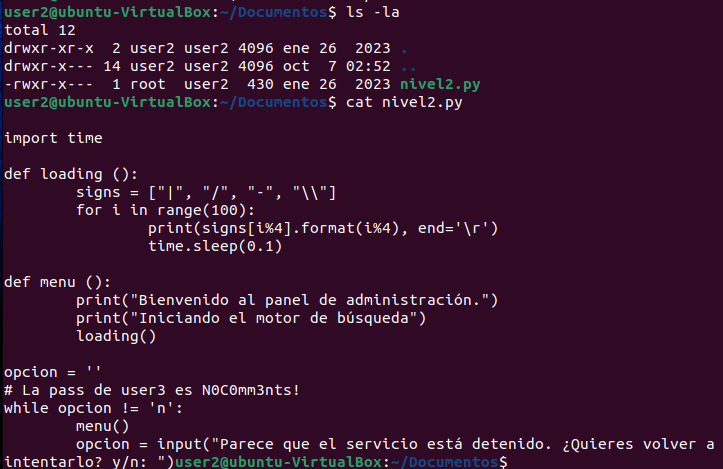

### 5. Acceso a `user3`

Con la contraseña `N0C0mm3nts!` se completa `su user3`. Dentro de `user3/Documentos/` aparece `nivel3.py`, que esta vez exige autenticación interactiva (usuario y contraseña) antes de revelar nada.

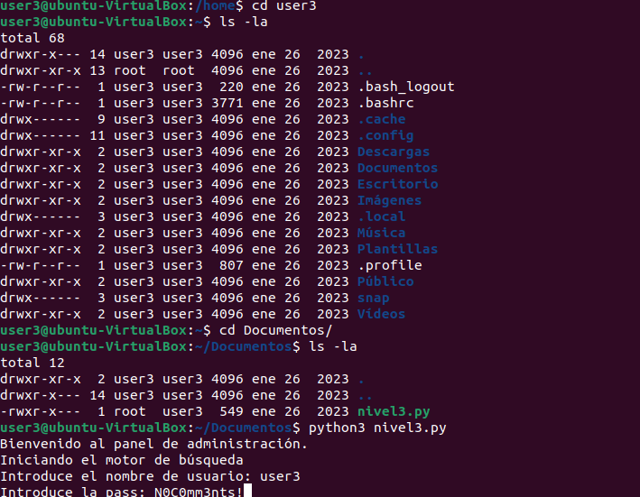

### 6. Resolución de `nivel3.py`

La lectura del código expone tanto el usuario válido (`devadmin`) como su contraseña en claro (`H4rdC0ding&F4il`). Introduciendo ambos valores, el script decodifica un Base64 interno y entrega la contraseña de `user4`.

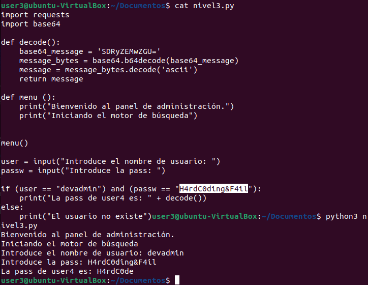

```text
echo SDRyZEMwZGU= | base64 -d
→ H4rdC0de   (pass de user4)
```

### 7. Resolución de `nivel4.py`

`nivel4.py` introduce una validación distinta: comprueba el número de argumentos recibidos por línea de comandos y exige la palabra `debug` en una posición concreta de `sys.argv`. Al cumplir la condición, decodifica la pass de `user5` en Base64.

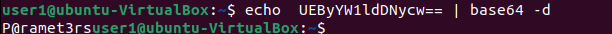
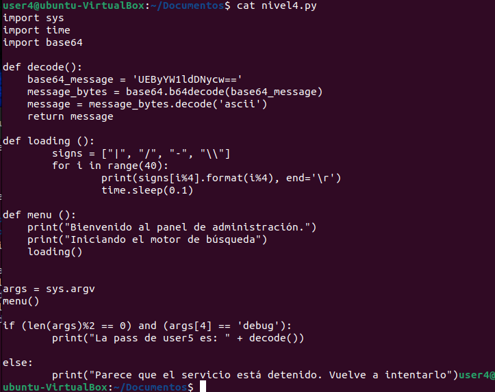

```text
echo UEByYW1ldDNycw== | base64 -d
→ P@ramet3rs   (pass de user5)
```

### 8. Resolución de `nivel5.py`

Con `user5` accedido, `nivel5.py` plantea un reto distinto: la clave de validación no está en el propio script, sino que se descarga en tiempo real desde un Gist público de GitHub (`trollface.txt`), tomando la penúltima línea del fichero como clave esperada. Al introducir esa clave como respuesta, se revela la pass de `user6`.

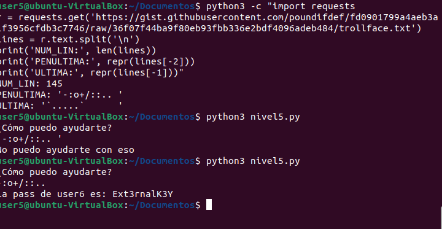
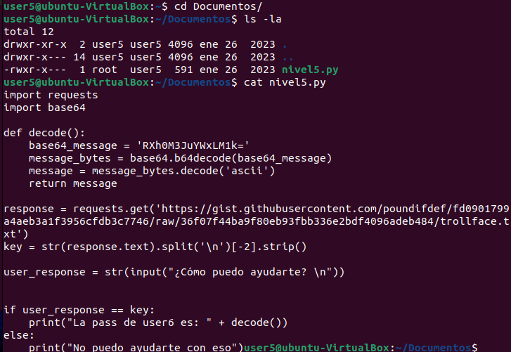

### 9. Resolución de `nivel6.py`

En `user6/Documentos/`, `nivel6.py` simula un concurso de registro de usuarios («Concurso 1.000.000»). La contraseña de `user7` se encuentra embebida directamente como constante Base64 en el código, sin necesidad de completar la lógica del concurso.

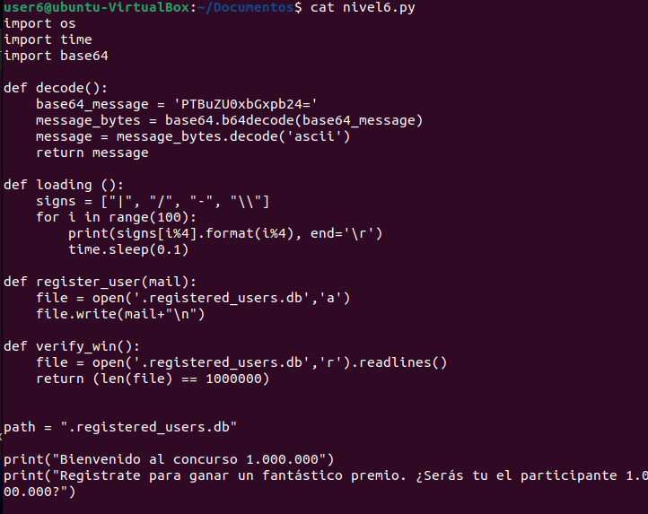
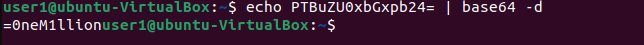

```text
echo PTBuZU0xbGxpb24= | base64 -d
→ =0neM1llion   (pass de user7)
```

### 10. Resolución de `nivel7_srv.py`

En `user7/Documentos/` aparece `nivel7_srv.py`, un servicio que levanta un socket TCP en `127.0.0.1:8050` y genera un OTP aleatorio para quien se conecte enviando el comando `user`. La contraseña de `user8` viaja igualmente codificada en Base64 dentro del propio script.

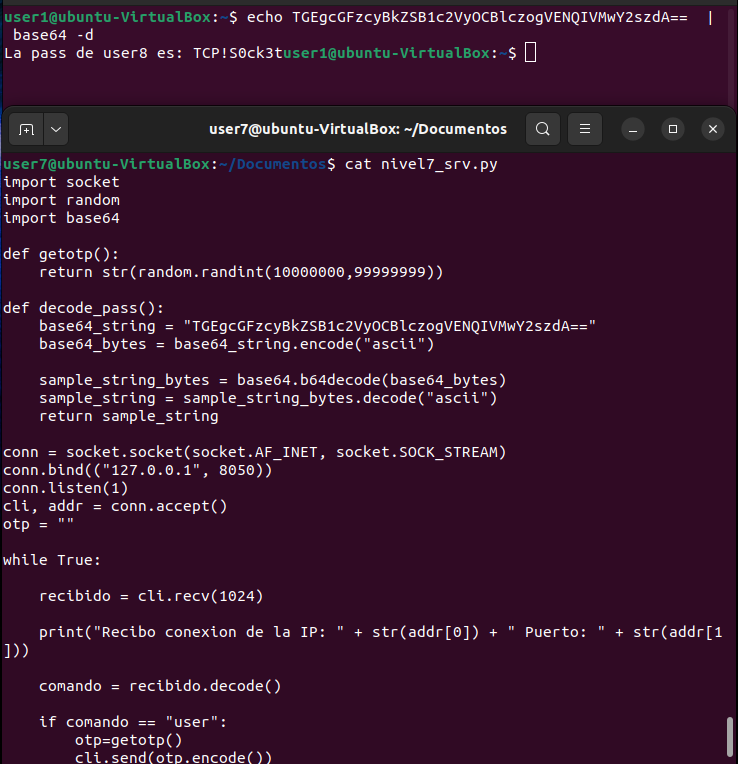

```text
echo TGEgcGFzcyBkZSB1c2VyOCBlczogVENQIVMwY2szdA== | base64 -d
→ La pass de user8 es: TCP!S0ck3t
```

### 11. Resolución de `nivel8.py`

Ya con `user8`, el script `nivel8.py` plantea un mini-juego de adivinar en qué vaso está la bolita, durante cinco rondas seguidas. La posición correcta no es aleatoria de verdad: se calcula a partir de la hora del sistema en el instante de ejecución (`HH:MM:SS`), lo que permite predecirla. Resolviendo el juego se obtiene la pass de `user9`.

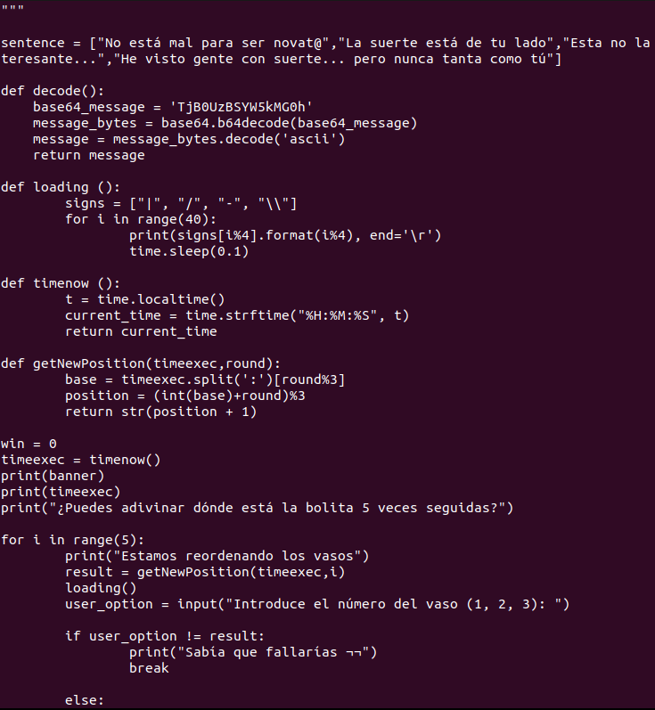
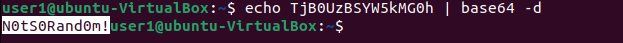

```text
echo TjB0UzBSYW5kMG0h | base64 -d
→ N0tS0Rand0m!   (pass de user9)
```

### 12. Resolución de `nivel9.py` y acceso root

En `user9/Documentos/` aparece el último script, `nivel9.py`: un panel de administración con tres niveles de privilegio (`low`, `medium`, `high`). En el nivel `medium` se expone la credencial de `user10`, pero codificada en **hexadecimal y además invertida** (`Hex(Reverse(password))`), lo que requiere encadenar dos transformaciones para recuperarla en claro.

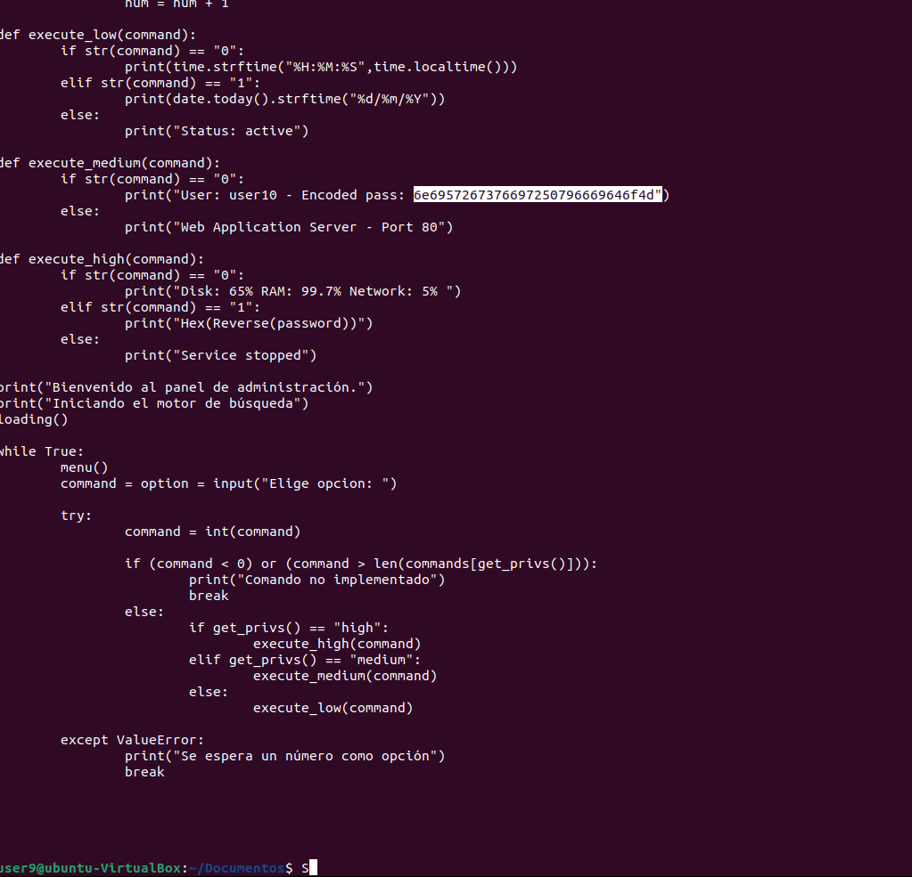
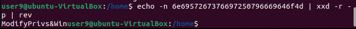

```text
echo -n 6e695726737669697250796669646f4d | xxd -r -p | rev
→ ModifyPrivs&Win   (pass de user10)
```

Con esa contraseña se realiza `su user10`. El propio sistema indica que, para ejecutar comandos como administrador, debe usarse `sudo`. Probando la misma contraseña con `sudo su`, se obtiene una shell como `root`, confirmada con `whoami`.

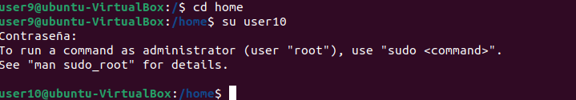
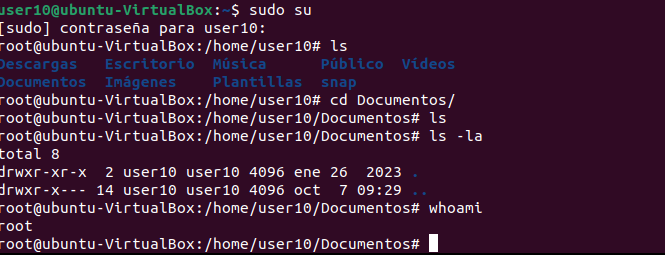

## Estructura del repositorio

```text
.
├── README.md
├── screenshots/        # 19 capturas de pantalla, en orden cronológico
│   ├── 01_user1_documentos_nivel1.png
│   ├── 02_ejecucion_nivel1_credencial_user2.png
│   ├── ...
│   └── 19_acceso_root.png
└── scripts/             # Transcripción del código de cada nivelX.py
    ├── nivel2.py
    ├── nivel3.py
    ├── nivel4.py
    ├── nivel5.py
    ├── nivel6.py
    ├── nivel7_srv.py
    ├── nivel8.py
    ├── nivel9.py
    └── decodificaciones_terminal.sh
```

## Notas sobre los scripts

Las reglas del ejercicio prohibían copiar o escribir ficheros en el directorio de los scripts, por lo que el código en `scripts/` **no son los ficheros originales**, sino una transcripción fiel de lo que se pudo leer con `cat` en cada captura de pantalla. `nivel1.py` no se incluye porque su contenido nunca llegó a leerse con `cat` durante la prueba (solo se ejecutó). En los niveles 6, 7, 8 y 9 el `cat` quedó cortado por el propio terminal antes de mostrar el final del fichero; esos scripts están marcados como parciales con un comentario explícito en el punto donde se pierde la captura.

## Lecciones aprendidas

El recorrido por los diez niveles repasa, de forma progresiva, varios antipatrones de seguridad habituales en código y configuraciones reales: credenciales en comentarios o como constantes en claro, ofuscación débil mediante Base64 (que no es cifrado), "aleatoriedad" predecible basada en la hora del sistema, dependencia de recursos externos no firmados como fuente de verdad, y reutilización de la misma contraseña entre un usuario sin privilegios y la cuenta con permisos `sudo`. Cada uno de estos patrones es, en un sistema real, una vía de escalada de privilegios evitable con buenas prácticas básicas de gestión de secretos.

## Aviso

Este repositorio documenta la resolución de un ejercicio formativo realizado en un entorno de laboratorio controlado (máquina virtual Ubuntu), con fines exclusivamente educativos. Las técnicas descritas no deben aplicarse sobre sistemas, cuentas o redes para los que no se disponga de autorización explícita.
