# 🕵️ Sniffing, Portknocking, NFS y acceso SSH

Informe técnico de un laboratorio de red en el que se combina captura de tráfico (sniffing), explotación de un mecanismo de portknocking, montaje de un recurso NFS mal configurado y exfiltración de una clave privada SSH, hasta conseguir acceso a la máquina víctima con un usuario perteneciente al grupo `sudo`.

| | |
|---|---|
| **Escenario** | Dos máquinas en red NAT: Kali (atacante) y "retillo" (víctima) |
| **IP atacante** | `10.0.2.11` |
| **IP víctima** | `10.0.2.8` |
| **Objetivo** | Capturar credenciales en tránsito, desbloquear servicios ocultos mediante portknocking y obtener acceso con privilegios `sudo` |
| **Resultado** | ✅ Acceso SSH confirmado como usuario `ubuntu`, miembro del grupo `sudo` |

## Tabla de contenidos

1. [Resumen del ataque](#resumen-del-ataque)
2. [Walkthrough detallado](#walkthrough-detallado)
3. [Estructura del repositorio](#estructura-del-repositorio)
4. [Notas sobre los scripts](#notas-sobre-los-scripts)
5. [Lecciones aprendidas](#lecciones-aprendidas)
6. [Aviso](#aviso)

## Resumen del ataque

| Fase | Técnica | Resultado |
|---|---|---|
| 1. Reconocimiento | `arp-scan` + Wireshark en `eth0` | Identificación de la IP víctima (`10.0.2.8`) por tráfico ICMP/ARP |
| 2. Sniffing HTTP | Seguimiento de un *HTTP Stream* en Wireshark | Credenciales en claro: `usuario=admin`, `palabra_secreta=LaBarbacoa` |
| 3. Reconocimiento de puertas | Login en el panel web con las credenciales obtenidas | Secuencia de portknocking: puertos `7003`, `8004`, `9005` |
| 4. Portknocking | `nmap` (todo cerrado) → `knock` → `nmap` (servicios visibles) | Apertura de `22/ssh`, `111/rpcbind`, `2049/nfs` |
| 5. Enumeración de servicios | `nmap -sV --script=ssh-hostkey,rpcinfo,nfs-showmount` | Confirmación de NFS activo y huella SSH |
| 6. Acceso a NFS | `showmount -e` + `mount -t nfs` | Recurso `/mnt/nfs_share` montado, con un directorio `.ssh` expuesto |
| 7. Exfiltración de clave | Copia de `private_keys/ubuntu/sshkey` | Clave privada SSH del usuario `ubuntu` |
| 8. Acceso final | `ssh -i id_rsa_ubuntu ubuntu@10.0.2.8` | Shell como `ubuntu`, en el grupo `sudo` |

## Walkthrough detallado

### 1. Captura de tráfico con Wireshark

Se inicia Wireshark sobre la interfaz `eth0` para observar el tráfico entre las máquinas de la red NAT, partiendo de la premisa de que existe una comunicación cliente-servidor activa.

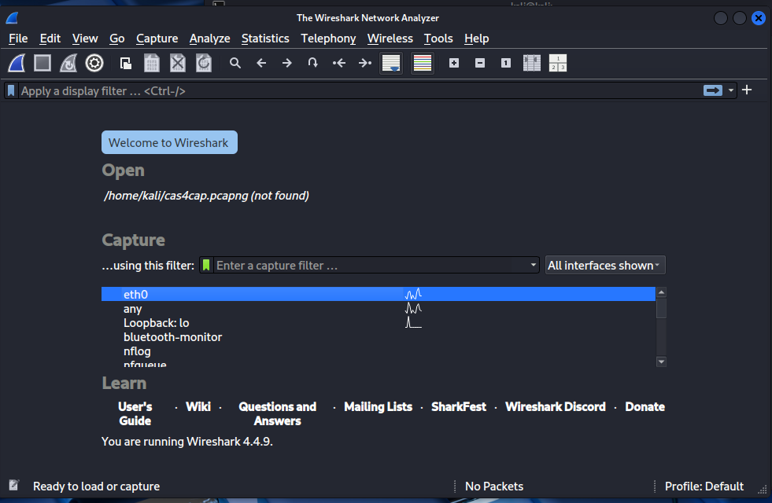

### 2. Identificación de la máquina atacante (Kali / LUbuntu)

Con `sudo arp-scan --localnet -I eth0` se listan los hosts visibles en la red. Al levantar la máquina LUbuntu aparecen dos IPs adicionales, indicio de que corre algún servicio. En Wireshark se observa que esta máquina envía pings ICMP intentando contactar con `10.0.2.10`.

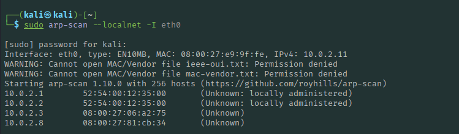


### 3. Identificación de la máquina víctima (retillo)

Se levanta la máquina "retillo" y, repitiendo el `arp-scan`, se confirma que su IP es `10.0.2.10` — la misma a la que intentaba conectarse la máquina LUbuntu.

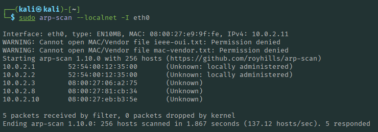

### 4. Sniffing de la petición de login (HTTP en claro)

Con ambas máquinas comunicándose, Wireshark muestra tráfico HTTP. En el paquete `1101` aparece un `POST /login.php HTTP/1.1`. Siguiendo el flujo (*Follow → HTTP Stream*) se recupera el contenido completo en texto plano.

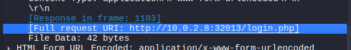

### 5. Credenciales obtenidas y acceso al panel

El stream HTTP revela tanto el host (`10.0.2.8:32013`) como las credenciales del formulario: `usuario=admin` y `palabra_secreta=LaBarbacoa`. Con ellas se accede al panel web, que expone la página `secreta.php` con tres "puertas" — la secuencia de portknocking: `7003`, `8004`, `9005`.

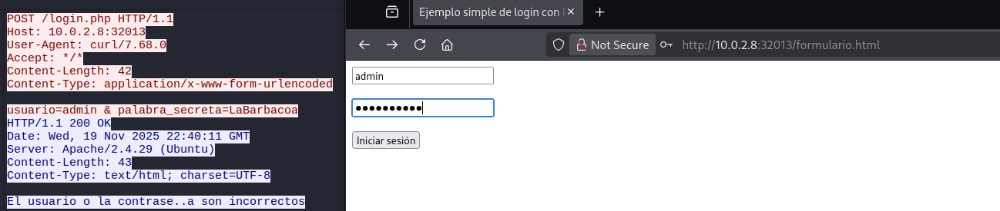
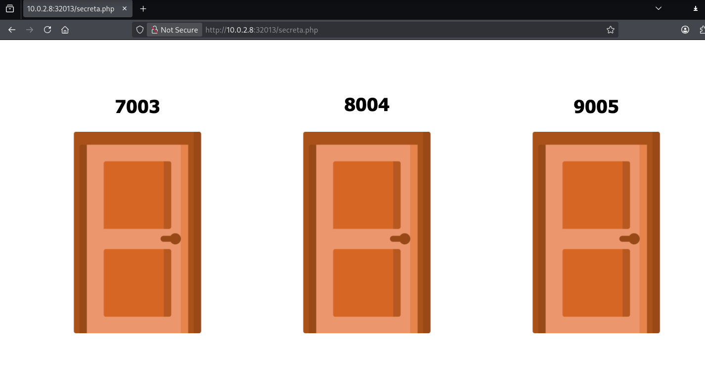

### 6. Escaneo inicial: todo cerrado

Un escaneo silencioso contra la víctima confirma que, sin la secuencia de portknocking, no hay puertos visibles desde fuera:

```text
sudo nmap -sS -Pn -n -vvv 10.0.2.8
```

- `-sS`: escaneo SYN (silencioso/stealth)
- `-Pn`: no enviar ping de descubrimiento
- `-n`: sin resolución DNS
- `-vvv`: máximo nivel de detalle

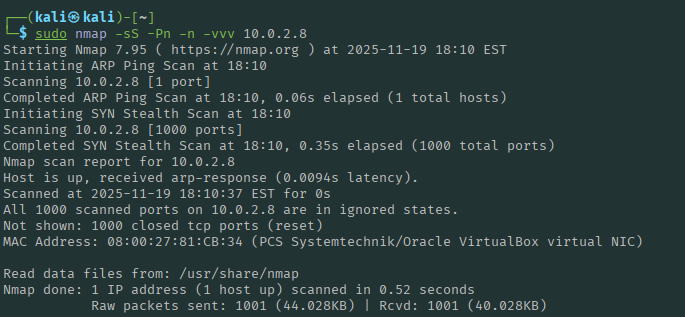

### 7. Portknocking

Con la secuencia de puertas obtenida del panel, se ejecuta el "golpeo" de puertos:

```text
knock 10.0.2.8 7003 8004 9005
```

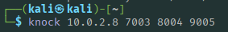

### 8. Escaneo tras el desbloqueo

Repitiendo el escaneo, ahora aparecen tres servicios abiertos: `22/ssh`, `111/rpcbind` y `2049/nfs`.

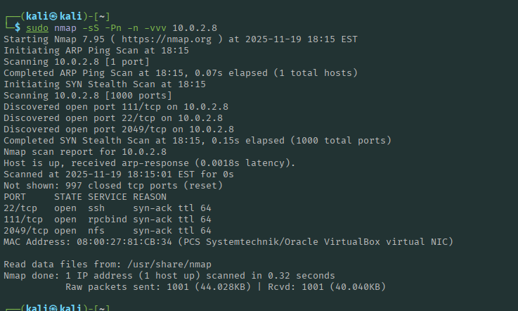

### 9. Enumeración detallada de los servicios

Se afina el escaneo apuntando directamente a los tres puertos detectados, con scripts específicos para SSH, RPC y NFS:

```text
nmap -sV -p22,111,2049 \
  --script="ssh-hostkey,rpcinfo,nfs-showmount" \
  10.0.2.8
```

El resultado confirma una huella SSH con cifrado robusto (RSA/ECDSA/ED25519) y, sobre todo, NFS activo en el puerto `2049`.

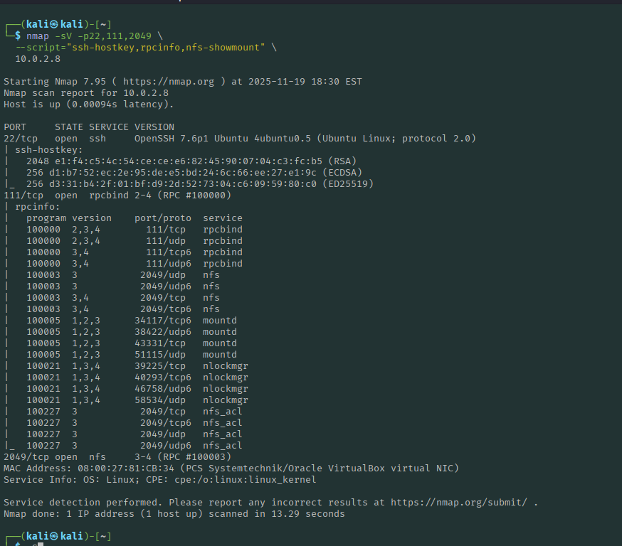

### 10. Montaje del recurso NFS

`showmount -e 10.0.2.8` confirma que el recurso `/mnt/nfs_share` se comparte sin restricciones (`*`). Se crea un punto de montaje local y se monta el share:

```text
sudo mkdir /mnt/target
sudo mount -t nfs 10.0.2.8:/mnt/nfs_share /mnt/target
```

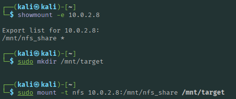

Si esta versión de montaje no negocia correctamente, se puede forzar NFSv3 sobre UDP:

```text
sudo mkdir -p /mnt/nfs
sudo mount -t nfs -o vers=3,proto=udp 10.0.2.8:/mnt/nfs_share /mnt/nfs
```

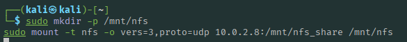

### 11. Localización de la clave SSH dentro del share

Listando el recurso montado aparece un directorio oculto `.ssh`, indicio claro de que ahí se guardan credenciales de acceso.

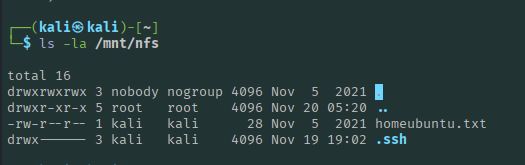

Navegando hasta `/mnt/nfs/.ssh/private_keys/` se encuentra una carpeta por usuario; dentro de `ubuntu/` está la clave privada (`sshkey`).

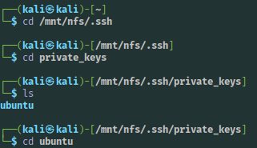

### 12. Exfiltración y preparación de la clave

Se copia la clave a nuestro propio `~/.ssh` y se ajustan los permisos a `600` (lectura/escritura exclusiva del propietario), requisito de OpenSSH para aceptar la clave:

```text
cp /mnt/nfs/.ssh/private_keys/ubuntu/sshkey ~/.ssh/id_rsa_ubuntu
chmod 600 ~/.ssh/id_rsa_ubuntu
```

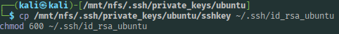

### 13. Acceso SSH con la clave exfiltrada

Con la clave ya preparada, se accede a la víctima indicando el archivo de identidad con `-i`:

```text
ssh -i ~/.ssh/id_rsa_ubuntu ubuntu@10.0.2.8
```

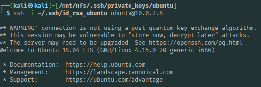

### 14. Verificación del objetivo

Ya dentro de la máquina, `whoami` confirma el usuario `ubuntu`, y `id` confirma su pertenencia al grupo `sudo` — el objetivo del laboratorio:

```text
uid=1000(ubuntu) gid=1000(ubuntu) grupos=1000(ubuntu),4(adm),24(cdrom),27(sudo)
```

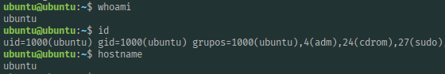

## Estructura del repositorio

```text
.
├── README.md
├── screenshots/                         # 18 capturas, en orden cronológico
│   ├── 01_wireshark_inicio.png
│   ├── 02_arpscan_lubuntu.png
│   ├── ...
│   └── 18_whoami_id_grupo_sudo.png
└── scripts/                             # Comandos agrupados por fase del ataque
    ├── 01_reconocimiento_sniffing.sh
    ├── 02_extraccion_credenciales_http.sh
    ├── 03_portknocking.sh
    ├── 04_nfs_exfiltracion_clave.sh
    └── 05_acceso_ssh_y_verificacion.sh
```

## Notas sobre los scripts

Los `.sh` de `scripts/` no son archivos que existieran en el laboratorio original (aquí no había scripts de reto como en otros ejercicios), sino una recopilación propia de los comandos realmente ejecutados durante la prueba, ordenados por fase y comentados para facilitar su reproducción. Se han corregido dos pequeñas erratas presentes en el informe original frente a lo que muestran las propias capturas: el nombre de los scripts de Nmap es `ssh-hostkey,rpcinfo,nfs-showmount` (no `ssh-hostey,rcpinf,nfs-showmount`) y la ruta de montaje NFS es `10.0.2.8:/mnt/nfs_share` (con barra inicial), tal y como se ve en pantalla.

## Lecciones aprendidas

Este laboratorio encadena varios fallos de seguridad frecuentes en entornos reales: transmisión de credenciales en texto plano sobre HTTP (sin TLS), un mecanismo de portknocking pensado como "seguridad por oscuridad" pero descubierto fácilmente desde la propia aplicación que debía protegerse, un recurso NFS exportado sin restricción de hosts ni de usuarios (`*`), y el almacenamiento de claves privadas SSH de varios usuarios accesibles desde ese mismo recurso compartido. Cualquiera de estos puntos, por sí solo, ya compromete la cadena completa de seguridad del sistema.

## Aviso

Este repositorio documenta la resolución de un ejercicio formativo realizado en un entorno de laboratorio controlado (máquinas virtuales en red NAT), con fines exclusivamente educativos. Las técnicas descritas no deben aplicarse sobre sistemas, cuentas o redes para los que no se disponga de autorización explícita.
